# 에러바운더리 관심사 분리

## 배경

React를 이용하여 개발하면 에러를 처리하는 방법이 다양하게 있다.
`try ~ catch` 문을 이용하여 에러를 핸들링 할 수 있을 것이고, tanstack query를 이용하는 경우 isError라는 값을 이용하여 에러를 핸들링 할 수 있을 것이다.

어떤 방법을 이용하는게 정답인 것이 아닌 개인 취향과 선호도에 따라 사용하는 방법이 나눠지게 된다.
이번에 내가 작성할 에러 처리 방법은 ErrorBoundary를 이용하여 에러를 선언적으로 처리하는 방법이다.

## 에러 바운더리란?

에러 바운더리(Error Boundary)는 React에서 컴포넌트 트리 내의 자식 컴포넌트에서 발생한 JavaScript 오류를 포착하고, 해당 오류로부터 전체 애플리케이션의 크래시를 방지하며, 사용자에게 폴백 UI를 표시할 수 있게 해주는 React 컴포넌트이다.

아래는 인프런에서 사용한 폴백 UI의 예시다. 앱을 사용하다가 도중에 에러가 발생하면 보이게 되는 UI이다.
에러 바운더리를 이용한다면 쉽게 폴백 UI를 설정할 수 있다.

## 에러 바운더리 사용방법

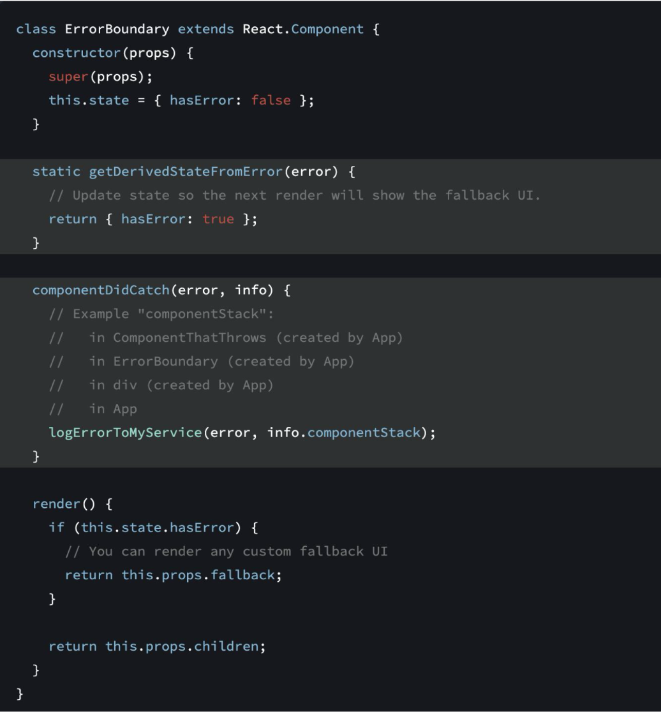

에러 바운더리는 기본적으로 React에서 기본적으로 제공해주지만 클래스형으로 만들어진 에러 바운더리이기에 함수형 컴포넌트가 아닌 클래스형 컴포넌트를 이용해야한다.

그래서 함수형 컴포넌트에서 에러 바운더리를 사용하려면 `react-error-boundary`라는 라이브러리를 이용해야 한다.

에러 바운더리의 사용법은 간단하게 `react-error-boundary` 라이브러리를 설치한 후 에러 바운더리를 설정할 영역에 ErrorBoundary 컴포넌트를 감싸주고, 에러가 발생했을 때 처리할 fallback component를 넣어주면 된다.

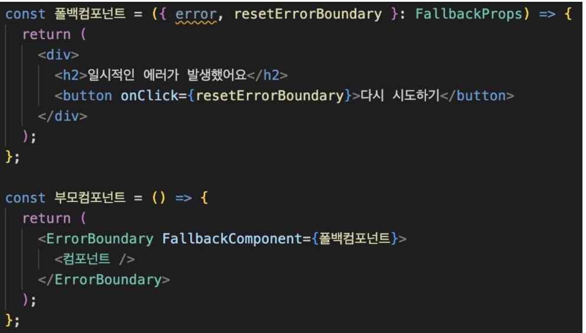

이렇게만 설정해줘도 `<컴포넌트 />` 내부에서 에러가 발생하면 에러가 상위로 전파되어 ErrorBoundary를 만나게 되고, 그럼 ErrorBoundary에서 정의한 폴백컴포넌트를 렌더링하게 된다.

## 에러마다 다르게 처리하고 싶은 경우

이렇게 상위에 에러 바운더리를 정의해두면 에러바운더리에서 어떠한 에러를 감지해도 동일한 폴백 컴포넌트를 보여주게 된다.
그렇다면 네트워크 에러가 발생했을때도, 권한 에러가 발생했을 때도, 런타임 에러가 발생했을 때도 모두 동일한 폴백컴포넌트에서 처리가 되는데 사용자 입장에서는 어떤 에러가 발생했는지 알 수가 없는 문제가 있다.

사용자 경험을 개선하기 위해 에러마다 다른 UI를 보여주거나, 토스트 메시지를 보여주는 방법으로 처리하는게 좋은데 나는 커스텀 에러를 활용하여 에러마다 다르게 처리하도록 해줄 것이다.

## 커스텀 에러

커스텀 에러는 기존 Error 객체를 상속받아 직접 커스텀하여 사용하는 에러를 말한다.

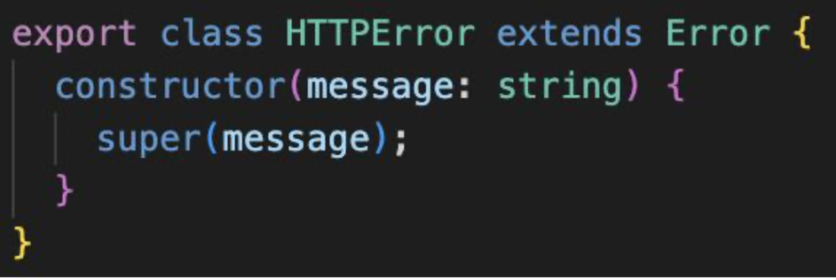

해당 코드와 같이 기존의 Error 객체를 상속받아 필요한 커스텀 에러를 직접 만들고, 만약 message 이외의 옵션이 필요하다면 직접 정의하여 사용할 수 있다.

### 커스텀 에러를 활용한 에러바운더리

바로 위 사진의 코드를 이용한다면 네트워크 에러가 발생했을 때 이용할 `HTTPError` 객체를 만들어 사용하면 우리는 이제 에러 폴백컴포넌트에서 에러에 따라 다르게 처리할 수 있게 된다.

예를들어 컴포넌트에서 네트워크 에러가 처리했을때는 `throw new Error(“네트워크 에러");` 가 아닌 `throw new HTTPError(“네트워크 에러");` 를 이용하여 커스텀 에러를 발생시키면 `Errorboundary`에서 해당 에러를 잡을것이고, 그러면 폴백 컴포넌트에서 에러의 객체타입에 따라 분기처리를 해주면 된다.

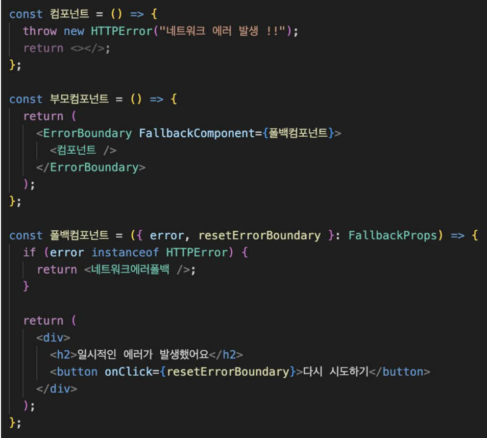

예시로 코드를 작성해봤는데 해당 코드와 같이 `instanceof`를 이용하여 에러의 객체에 따라 다른 컴포넌트를 보여줄 수 있게 되었다.

그렇다면 이제 커스텀 에러를 여러개 만들어두고, 에러가 발생했을 때나, 아니면 필요한 에러를 발생시킬 때 직접 정의한 커스텀 에러를 발생시키면 된다.

그러면 에러 바운더리에서 위와 같이 `instanceof`를 이용하여 아래와 같이 다양한 에러 핸들링을 할 수 있다.

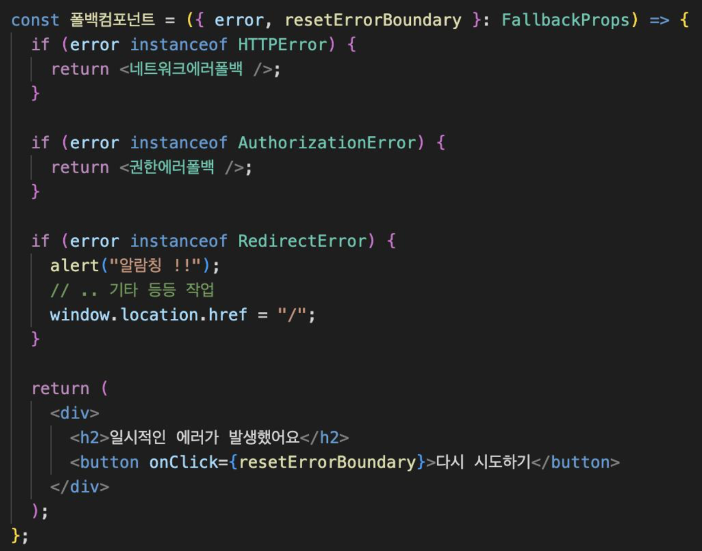

이 정도 코드를 이용해도 충분히 에러바운더리를 이용하여 다양한 처리가 가능하다.
하지만 폴백컴포넌트의 역할이 너무 많기에 가독성이 안좋아지는 문제가 있다.

## 에러바운더리의 관심사 분리

함수의 역할과 책임을 분리하기 위해 우리는 위에서 봤던것 처럼 명령형으로 처리하던 에러 핸들링을 선언형으로 처리하여 코드의 가독성을 높일 수 있다.

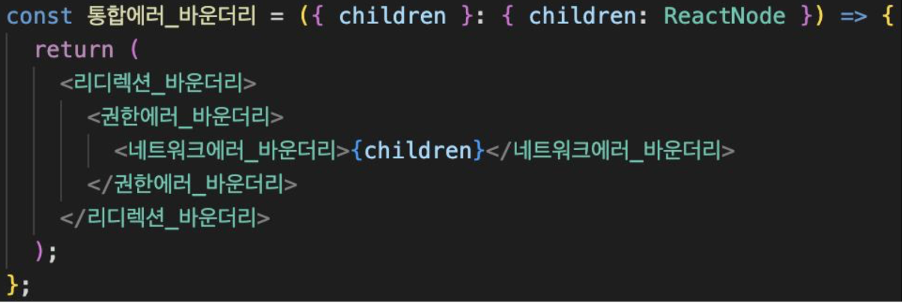

이렇게 하나의 에러에 대해 처리하는 에러바운더리를 각각 만들어서 관심사분리를 하여 가독성도 높이고, 재사용성도 높일 수 있다. 그러면 해당 바운더리 내부 코드를 확인해보면 아래와 같다.

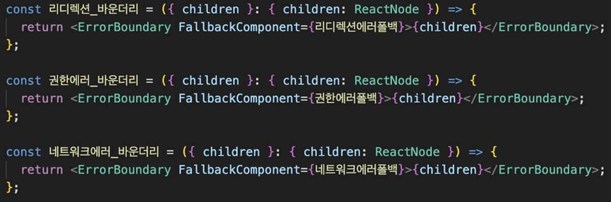

이전에 에러바운더리를 선언하듯이 각각의 다른 FallbackComponent를 호출하는 선언형 에러바운더리를 만들어준다.

그렇다면 우리는 특정 엘리먼트에 에러바운더리를 처리하고 싶다면 해당 부모에 원하는 에러바운리를 선언해주면 쉽게 사용할 수 있다.

하지만 에러 바운더리 자식 요소에서 전파되는 모든 에러를 잡아서 처리를 하는데 어떻게 여러개의 에러바운더리를 선언하여 사용할 수 있을까?

아래와 같이 에러바운더리에서 원하는 커스텀에러가 아니면 에러를 다시 상위로 전파시키면 된다.

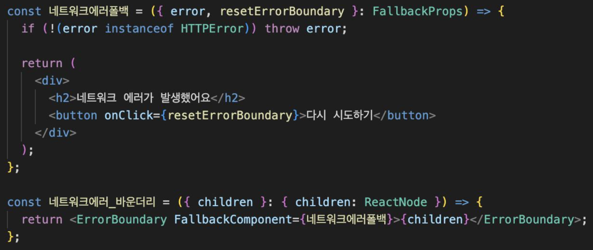

이렇게 함으로써 각각의 에러바운더리는 관심사 분리가 잘 되었고, 코드의 가독성 및 재사용성을 챙길 수 있게 되었다.

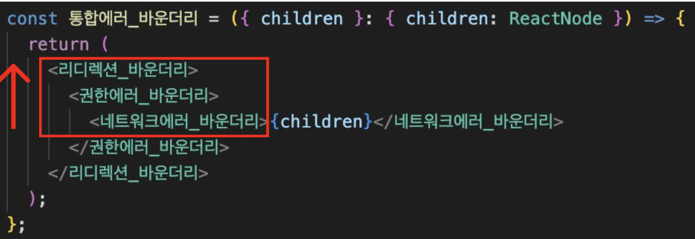

해당 코드를 다시 보면 자식 요소에서 리디렉션 커스텀 에러를 발생시킨다면 먼저 `네트워크에러바운더리`에 들어가게 되지만 해당 바운더리에서 네트워크 에러가 아니기에 `권한에러바운더리`로 에러를 전파시킨다. `권한에러바운더리`도 마찬가지로 본인의 관심사 에러가 아니기에 `리디렉션바운더리`로 전파시키게 되고, 해당 바운더리에서 처리가 된다.

## 에러바운더리 관심사 분리의 재사용성

에러바운더의 관심사 분리를 한다면 코드의 가독성이 좋아지는건 알겠는데 그러면 어떻게 재사용성이 높아질까?
우선 코드먼저 확인해보겠다

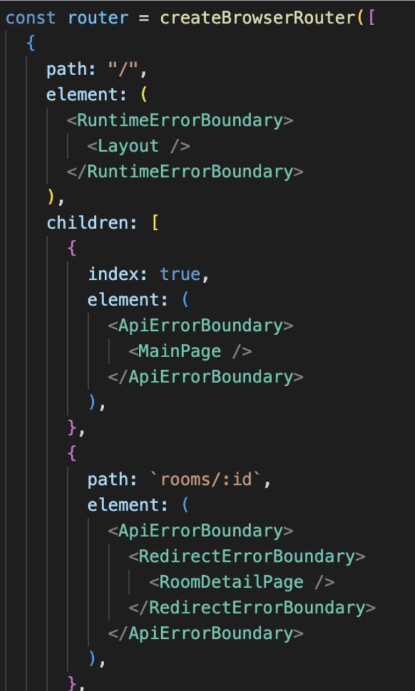

해당 코드는 라우팅 설정한 코드인데 각 페이지별로 필요한 에러바운더리만 선언적으로 감싸주기만 한다면 쉽게 사용할 수 있으며 재사용하기 쉬워졌다.

### 에러바운더리의 속성

에러바운더리의 FallbackComponent의 컴포넌트의 props 에 FallbackProps 타입이 존재한다.

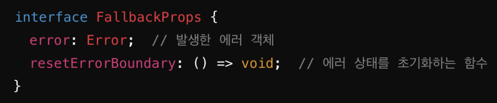

error객체는 이때까지 봤던데로 하위 컴포넌트에서 발생시킨 에러 객체를 의미한다. 그리고 추가적으로 resetErrorBoundary가 있는데 해당 함수는 Fallback Page에서 다시 에러난 부분 페이지의 렌더링을 시도할 때 사용되는 함수이다.

예를들어 폴백컴포넌트의 UI가 렌더링이 되었지만 유저가 “다시 시도하기"등의 버튼을 눌러 다시 페이지에 접속을 시도하기 위해 사용되는 함수이다.

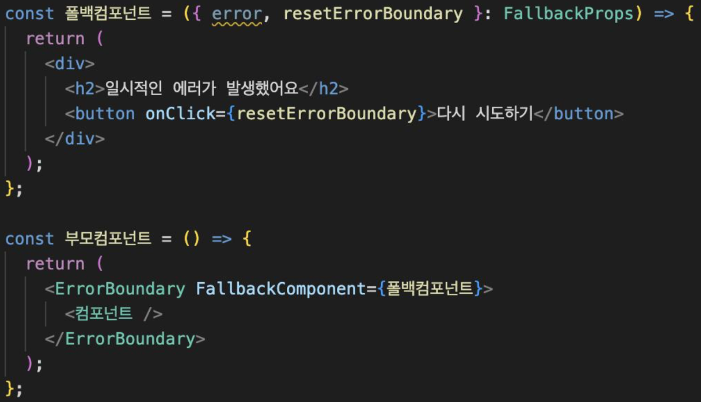

## 에러바운더리를 Tanstack Query와 사용하는 경우

만약 에러바운더리를 Tanstack Query와 함께 사용하는 경우 resetErrorBoundary 함수를 호출할 때 조금 문제가 발생할 수 있다.

만약 Tanstack Query로 데이터패칭 과정에서 에러가 발생하는 경우 유저는 에러폴백 UI를 마주하게 된다.
이때 Tanstack Query에서 기본적으로 서버의 응답을 캐시에 저장하기에 유저가 resetErrorBoundary 함수를 호출하면 캐시에 저장된 에러를 불러오기 때문에 유저는 서버의 응답과 상관없이 다시 에러 페이지를 마주하게 되는 문제가 있다.

그래서 만약 Tanstack Query를 위한 에러바운더리를 구성하기 위해 추가적인 옵션을 설정할 필요가 있다.

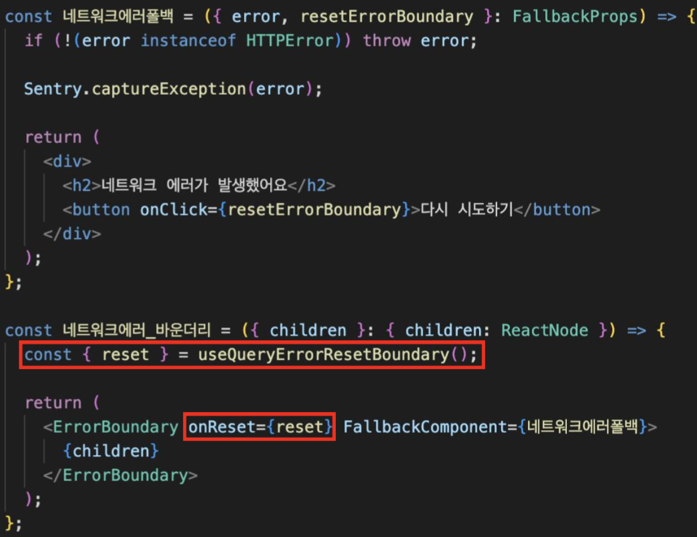

그 방법은 useQueryErrorResetBoundary의 reset 함수를 ErrorBoundary의 onReset에 넣어주는 방법이다. 해당 방법을 이용하면 유저가 resetErrorBoundary 함수를 호출하며 Tanstack Query에 캐싱된 에러값이 사라지게 되어 정상적으로 다시 페이지 렌더링 시도를 할 수 있게된다.
